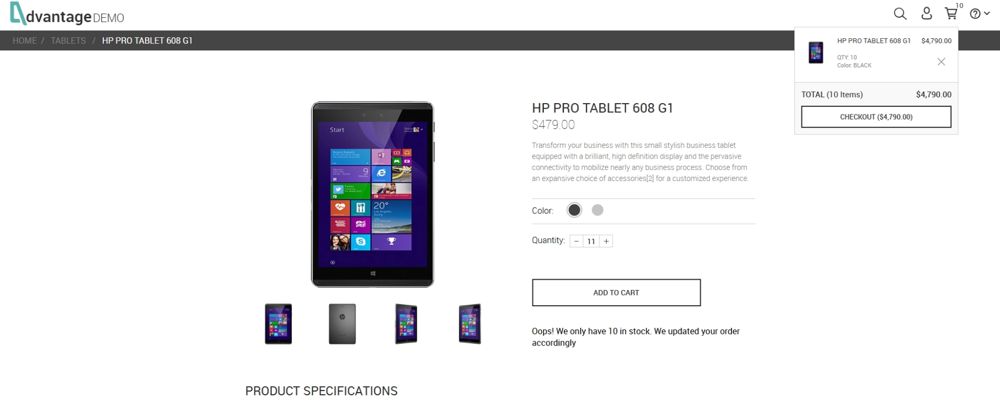

# 🐞 BUG-001 – Inconsistência na exibição da mensagem de limite de estoque entre usuários autenticados e não autenticados

## Resumo

Ao tentar adicionar uma quantidade superior ao estoque disponível pela primeira vez, o sistema exibe corretamente a mensagem informando que apenas a quantidade disponível foi adicionada ao carrinho.

Entretanto, após retornar à página inicial e acessar novamente o mesmo produto, novas tentativas de exceder o estoque deixam de exibir essa mensagem para usuários não autenticados, embora a quantidade adicionada ao carrinho continue sendo limitada corretamente.

Esse comportamento não ocorre para usuários autenticados, que continuam recebendo a mensagem em todas as tentativas.

---

## Ambiente

- **Aplicação:** Advantage Online Shopping
- **Navegador:** Google Chrome
- **Usuário:** Não autenticado

---

## Pré-condições

- Usuário não autenticado.
- Carrinho vazio.

---

## Passos para reprodução

1. Acessar um produto.
2. Informar uma quantidade superior ao estoque disponível (ex.: **11 unidades**).
3. Clicar em **ADD TO CART**.
4. Verificar que o sistema exibe a mensagem de limite de estoque e adiciona apenas **10 unidades** ao carrinho.
5. Retornar à página inicial.
6. Acessar novamente o mesmo produto.
7. Informar novamente uma quantidade superior ao estoque disponível.
8. Clicar em **ADD TO CART**.

---

## Resultado esperado

Sempre que o usuário tentar adicionar uma quantidade superior ao estoque disponível, o sistema deve:

- Limitar a quantidade adicionada ao carrinho.
- Exibir a mensagem informando que apenas a quantidade disponível foi adicionada.

Esse comportamento deve permanecer consistente independentemente da navegação realizada pelo usuário.

---

## Resultado obtido

Após retornar ao produto, o sistema continua limitando corretamente a quantidade adicionada ao carrinho em **10 unidades**, porém deixa de exibir a mensagem de validação para usuários não autenticados.

---

## Impacto

Embora a regra de negócio continue funcionando corretamente, a ausência da mensagem pode levar o usuário a acreditar que sua ação não foi processada ou que ocorreu alguma falha na aplicação.

Além disso, o comportamento torna-se inconsistente entre usuários autenticados e não autenticados.

---

## Severidade

**Média**

A funcionalidade principal permanece operacional, porém há perda de feedback ao usuário em um cenário específico.

---

## Prioridade

**Média**

Não impede a conclusão da compra, mas compromete a experiência do usuário e gera inconsistência de comportamento.

---

## Evidências

### Figura 1 – Primeira tentativa

**Descrição**

Usuário não autenticado tenta adicionar **11 unidades**.

**Resultado observado**

- Mensagem de limite de estoque exibida corretamente.
- Carrinho ajustado para **10 unidades**.

---

### Figura 2 – Tentativa após retornar à Home

**Descrição**

Após retornar à página inicial e acessar novamente o mesmo produto, o usuário tenta adicionar novamente uma quantidade superior ao estoque.

**Resultado observado**

- Carrinho permanece limitado a **10 unidades**.
- A mensagem de validação deixa de ser exibida.

---

## Observações

- O comportamento foi reproduzido em aproximadamente **6 produtos diferentes**.
- O problema ocorre apenas para usuários **não autenticados**.
- Usuários autenticados continuam recebendo a mensagem normalmente em tentativas subsequentes.
- A regra de negócio permanece funcionando corretamente, limitando a quantidade adicionada ao carrinho ao estoque disponível.
