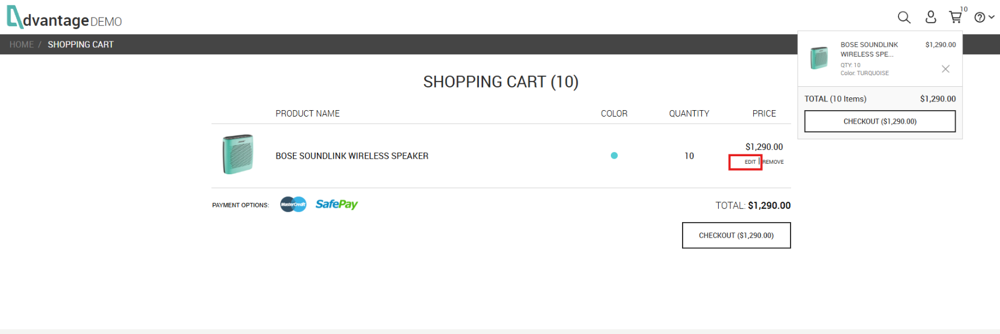
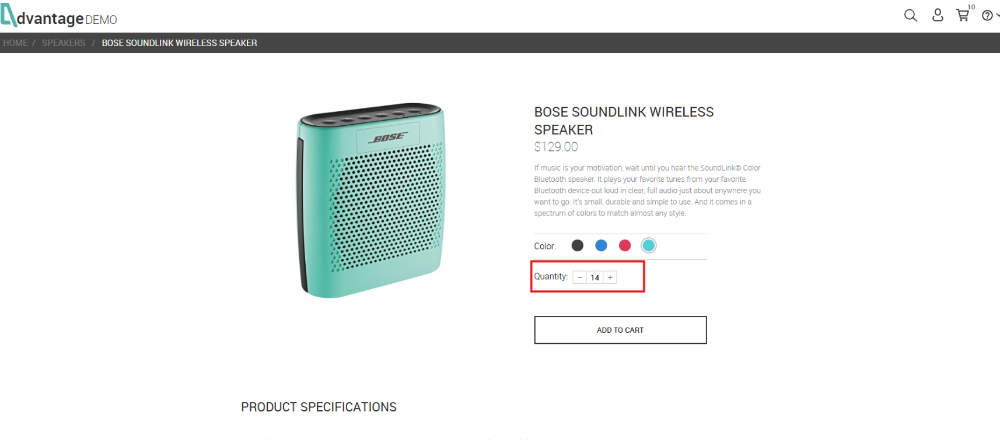
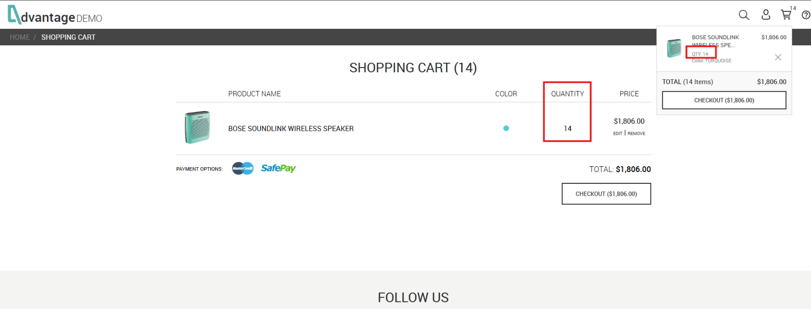
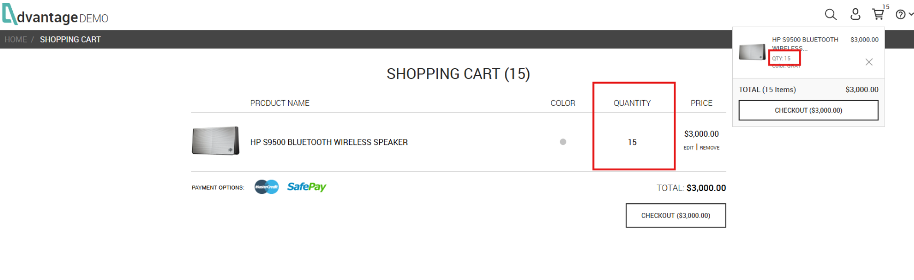
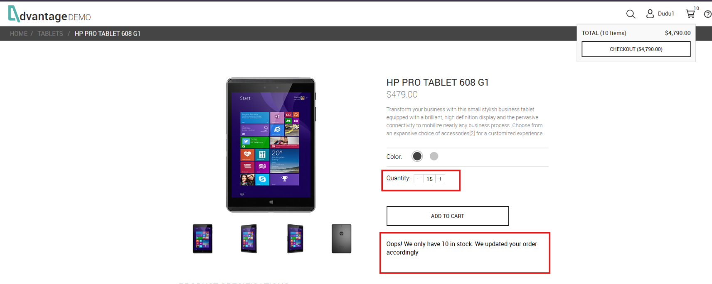
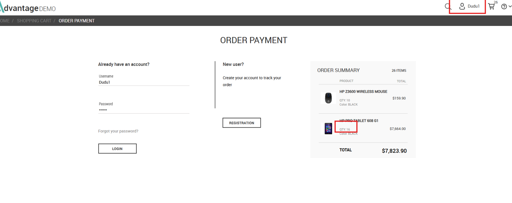

# 🐞 BUG-002 – Edição da quantidade permite ultrapassar o limite de estoque para usuários não autenticados

---

# Resumo

Ao editar a quantidade de um produto diretamente pelo carrinho de compras, um usuário **não autenticado** consegue definir uma quantidade superior ao estoque disponível.

Após confirmar a edição, o sistema aceita a nova quantidade sem exibir qualquer mensagem de validação, atualiza o carrinho com o valor informado e permite que o usuário prossiga normalmente para o checkout.

Mesmo após a autenticação durante o processo de compra, a quantidade acima do estoque permanece no resumo do pedido, indicando que a regra de negócio de validação de estoque não é reaplicada.

O comportamento não ocorre para usuários autenticados, que permanecem limitados ao estoque disponível durante a edição da quantidade.

---

# Ambiente

- **Aplicação:** Advantage Online Shopping
- **Plataforma:** Web
- **Navegador:** Google Chrome
- **Usuário afetado:** Não autenticado

---

# Pré-condições

- Usuário não autenticado.
- Produto adicionado ao carrinho com a quantidade máxima permitida (10 unidades).

---

# Passos para reprodução

1. Acessar qualquer produto disponível.
2. Adicionar o limite máximo permitido (10 unidades) ao carrinho.
3. Acessar o carrinho de compras.
4. Selecionar **EDIT** no produto.
5. Alterar a quantidade para um valor superior ao estoque disponível (14, 15 ou 16 unidades).
6. Clicar em **ADD TO CART**.
7. Verificar o carrinho.
8. Prosseguir para o checkout.
9. Realizar login com uma conta existente.

---

# Resultado esperado

O sistema deve impedir que a quantidade do produto ultrapasse o estoque disponível em qualquer etapa da aplicação.

Ao informar uma quantidade superior ao estoque, a aplicação deve:

- limitar automaticamente a quantidade ao estoque disponível;
- impedir a atualização da quantidade;
- ou exibir uma mensagem informando que o estoque disponível foi excedido.

Além disso, qualquer inconsistência deve ser validada novamente antes da conclusão da compra e após a autenticação do usuário.

---

# Resultado obtido

Ao editar a quantidade do produto pelo carrinho e informar um valor superior ao estoque disponível, o sistema aceita a alteração sem apresentar qualquer mensagem de validação.

Após clicar em **ADD TO CART**, o usuário retorna ao carrinho com a quantidade inválida registrada (14, 15 ou 16 unidades).

O valor total do pedido é recalculado utilizando essa quantidade incorreta.

Ao prosseguir para o checkout e realizar login, a quantidade inválida continua presente no resumo do pedido, demonstrando que nenhuma nova validação de estoque é realizada.

---

# Impacto

O sistema permite que usuários não autenticados contornem a regra de negócio responsável pelo controle de estoque.

Como consequência:

- produtos permanecem no carrinho acima do estoque disponível;
- o valor total é calculado utilizando uma quantidade inválida;
- o usuário consegue avançar até o checkout;
- a autenticação não corrige a inconsistência;
- o fluxo de compra permanece inconsistente até a etapa de pagamento.

---

# Severidade

**Alta**

**Justificativa:**

A falha permite violar uma regra crítica de negócio relacionada ao controle de estoque, comprometendo diretamente o fluxo de compra.

---

# Prioridade

**Alta**

**Justificativa:**

O defeito afeta diretamente um processo crítico da aplicação (Carrinho de Compras e Checkout) e deve ser corrigido com prioridade.

---

# Evidências

## 🎥 Vídeo de reprodução

**Descrição**

O vídeo abaixo demonstra todo o fluxo de reprodução do defeito, desde a edição da quantidade do produto no carrinho até a permanência da quantidade acima do estoque durante o checkout.

**Arquivo:** `reproduction.mp4`

---

## Figura 1 – Produto com quantidade máxima permitida

**Descrição**

Produto inicialmente adicionado ao carrinho com o limite permitido de **10 unidades** antes da edição.

---

## Figura 2 – Edição da quantidade

**Descrição**

Durante a edição do produto, a quantidade é alterada para **14 unidades**, valor superior ao estoque disponível.

---

## Figura 3 – Carrinho atualizado incorretamente

**Descrição**

Após confirmar a edição, o carrinho passa a apresentar **14 unidades**, ultrapassando o limite permitido.

---

## Figura 4 – Reprodução utilizando outro produto

**Descrição**

O comportamento também foi reproduzido utilizando outro produto, permitindo definir **15 unidades**.

---

## Figura 5 – Comportamento esperado para usuário autenticado

**Descrição**

Ao repetir o procedimento utilizando um usuário autenticado, o sistema limita automaticamente a quantidade para **10 unidades** e apresenta a mensagem de validação.

---

## Figura 6 – Quantidade inválida permanece após autenticação

**Descrição**

Após realizar login durante o checkout, o resumo do pedido continua apresentando quantidade superior ao estoque disponível, demonstrando que nenhuma nova validação de estoque é realizada.

---

# Observações

- O comportamento foi reproduzido utilizando diferentes produtos.
- O problema ocorre apenas para usuários não autenticados.
- Usuários autenticados não conseguem reproduzir a falha.
- O carrinho recalcula corretamente o valor utilizando a quantidade inválida, indicando que não se trata apenas de um erro visual.
- A quantidade acima do estoque permanece durante o checkout mesmo após a autenticação do usuário.
