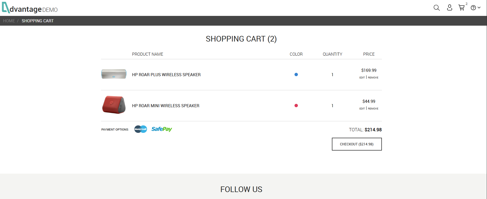
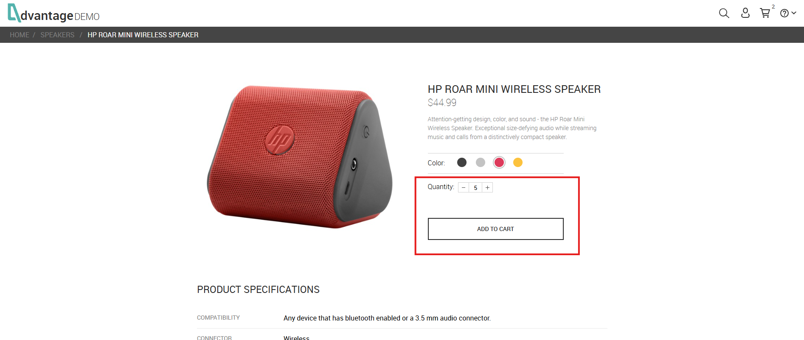
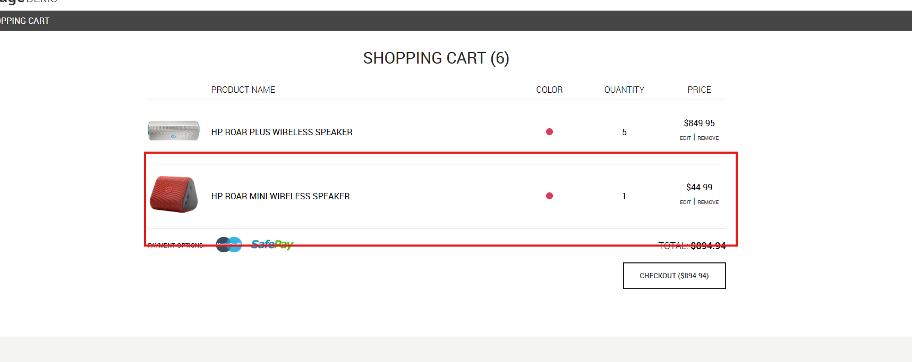
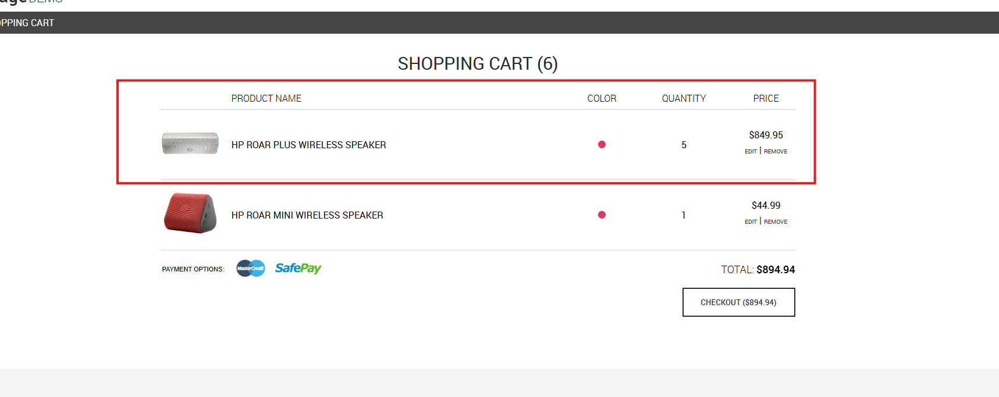
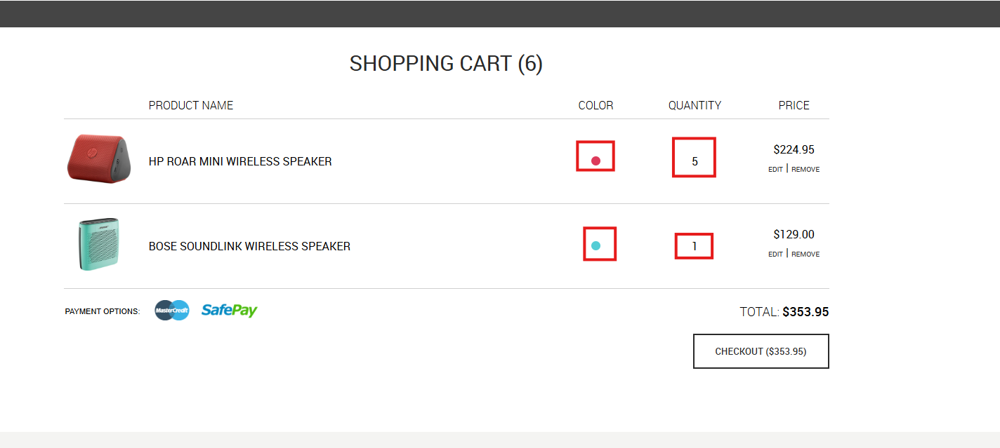

# BUG-003 – Sistema aplica alterações ao item incorreto do carrinho durante a edição de produtos para usuários não autenticados

---

# Resumo

Ao editar um produto diretamente pelo carrinho utilizando um usuário não autenticado, o sistema abre corretamente o produto selecionado para edição. Entretanto, após confirmar a alteração, as modificações são aplicadas ao **primeiro produto listado no carrinho**, em vez do item selecionado.

Durante os testes foi observado que o problema não afeta apenas a quantidade do produto. Outros atributos, como a **cor**, também passam a corresponder ao produto editado, indicando que o sistema está atualizando o item incorreto do carrinho.

O comportamento não foi reproduzido com usuário autenticado.

---

# Ambiente

- **Aplicação:** Advantage Online Shopping
- **Plataforma:** Web
- **Navegador:** Google Chrome
- **Usuário afetado:** Não autenticado

---

# Pré-condições

- Usuário não autenticado.
- Carrinho contendo pelo menos dois produtos diferentes.

---

# Passos para reprodução

1. Adicionar dois ou mais produtos diferentes ao carrinho.
2. Acessar o carrinho de compras.
3. Selecionar **EDIT** em um produto que não seja o primeiro item da lista.
4. Alterar apenas a quantidade do produto.
5. Confirmar a alteração clicando em **ADD TO CART**.
6. Retornar ao carrinho.

---

# Resultado esperado

O sistema deve aplicar todas as alterações exclusivamente ao produto selecionado para edição, preservando as informações dos demais itens presentes no carrinho.

---

# Resultado obtido

Após confirmar a edição, o sistema aplica as alterações ao primeiro item do carrinho, mesmo quando outro produto foi selecionado para edição.

Durante os testes foi observado que:

- a quantidade do primeiro produto é atualizada;
- a cor do primeiro produto passa a corresponder à cor do produto editado, mesmo sem qualquer alteração manual de cor durante o fluxo;
- o produto originalmente selecionado permanece sem as alterações esperadas.

Ao repetir o mesmo fluxo utilizando um usuário autenticado, apenas o produto selecionado é atualizado, conforme esperado.

---

# Impacto

O defeito compromete a integridade das informações do carrinho ao aplicar alterações em um produto diferente daquele selecionado pelo usuário.

Como consequência:

- visualizar atributos incorretos em um produto;
- modificar quantidades de itens não selecionados;
- gerar inconsistências no carrinho de compras;
- concluir uma compra com informações diferentes das pretendidas.

Esse comportamento compromete a confiabilidade do fluxo de edição do carrinho.

---

# Severidade

**Alta**

**Justificativa:**

O sistema altera informações de um produto diferente daquele selecionado pelo usuário, comprometendo diretamente a consistência dos dados do carrinho e podendo resultar em pedidos incorretos.

---

# Prioridade

**Alta**

**Justificativa:**

O defeito afeta uma funcionalidade crítica do processo de compra. Como impacta diretamente as informações dos produtos presentes no carrinho, sua correção deve ser tratada com alta prioridade.

---

# Evidências

## Figura 1 – Estado inicial do carrinho

### Descrição

Carrinho contendo múltiplos produtos antes do início do teste.

---

## Figura 2 – Edição do segundo produto

### Descrição

Usuário seleciona o segundo produto do carrinho para edição e altera apenas sua quantidade.

---

## Figura 3 – Alterações aplicadas ao produto incorreto

### Descrição

Após confirmar a edição, o primeiro produto do carrinho recebe a nova quantidade, enquanto o produto selecionado permanece inalterado.

---

## Figura 4 – Alteração indevida da cor do produto

### Descrição

Além da quantidade, o primeiro produto passa a apresentar também a cor do produto editado, evidenciando que as alterações foram aplicadas ao item incorreto.

---

## Figura 5 – Comportamento correto com usuário autenticado

### Descrição

Ao repetir o mesmo fluxo utilizando um usuário autenticado, somente o produto selecionado é atualizado, preservando corretamente os demais itens do carrinho.

---

# Observações

- O comportamento foi reproduzido diversas vezes durante os testes.
- O defeito foi validado em cenários contendo **2, 3 e 5 produtos** no carrinho.
- Independentemente do produto selecionado para edição, as alterações foram sempre aplicadas ao primeiro item da lista.
- O botão **EDIT** direciona corretamente para a página do produto selecionado; o comportamento incorreto ocorre somente após a confirmação da edição.
- Durante os testes foi observado que, embora apenas a quantidade tenha sido alterada pelo usuário, outros atributos do produto, como a **cor**, também passaram a corresponder ao item editado.
- O comportamento não foi reproduzido com usuário autenticado.
