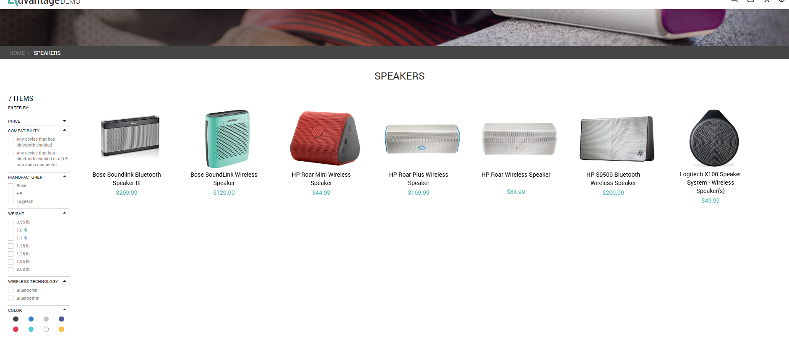
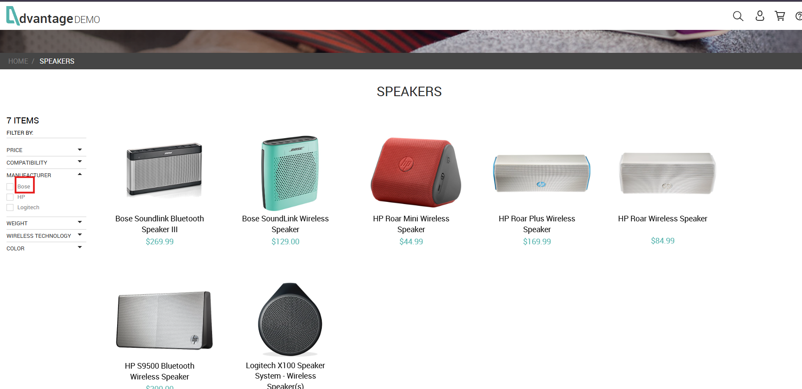
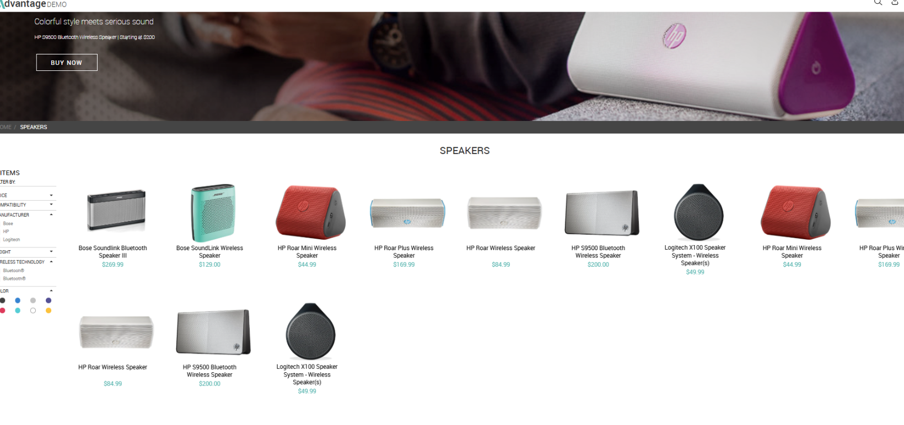
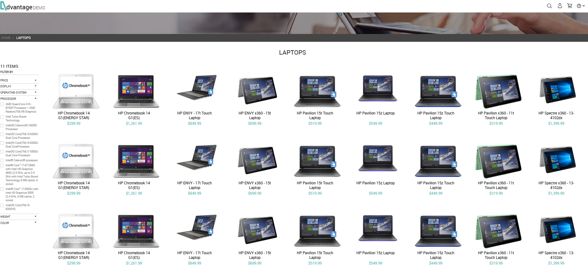
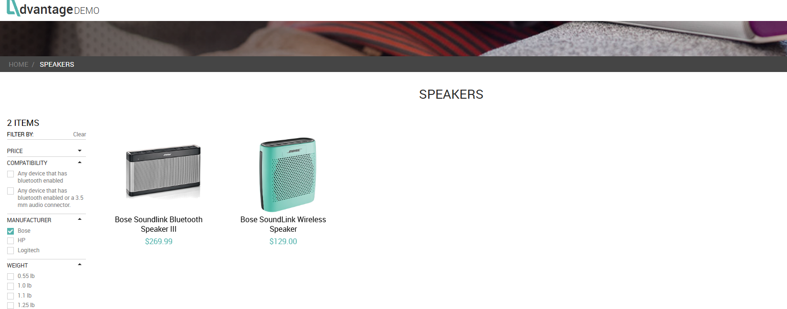

# BUG-004 – Clicking the Filter Label Does Not Apply the Filter and Causes Temporary UI Inconsistencies

---

# Summary

When clicking the text (label) of a filter option instead of its corresponding checkbox, the application does not apply the selected filter.

During this interaction, the interface temporarily renders duplicated products and duplicated filter elements before automatically returning to its original state without applying the filter.

The issue was reproduced in different product categories, indicating that the behavior is not isolated to a single page.

---

# Environment

- **Application:** Advantage Online Shopping
- **Platform:** Web
- **Browser:** Google Chrome

---

# Preconditions

- User is on any product listing page.
- Filter options are available in the left sidebar.

---

# Steps to Reproduce

1. Open any product category (e.g. Speakers).
2. Locate the filter sidebar.
3. Click the **text (label)** of any filter option instead of its checkbox.
4. Observe the page behavior.

---

# Expected Result

Clicking the filter label should perform the same action as clicking its corresponding checkbox.

The selected filter should be applied immediately without causing any visual inconsistencies.

---

# Actual Result

After clicking the filter label:

- the selected filter is not applied;
- products are temporarily duplicated;
- filter options are temporarily duplicated or visually corrupted;
- after a few moments, the interface returns to its original state without applying the selected filter.

When the checkbox itself is clicked, the filter works correctly.

---

# Impact

The defect negatively affects the user experience by suggesting that the filter label is interactive while failing to execute the expected action.

Additionally, the temporary duplication of products and filter elements creates the impression of an unstable interface and reduces the perceived reliability of the application.

---

# Severity

**Low**

### Justification

The defect does not block the filtering functionality because users can still apply filters through the corresponding checkbox.

However, the incorrect interaction and temporary UI corruption negatively affect usability.

---

# Priority

**Medium**

### Justification

Filtering is a frequently used feature in e-commerce applications.

Although no business rule is violated, the defect directly impacts user interaction and should be corrected to improve interface consistency.

---

# Evidence

## Figure 1 – Initial product listing

### Description

Product listing displayed normally before interacting with the filter options.

---

## Figure 2 – Clicking the filter label

### Description

The user clicks the text (label) of the manufacturer filter instead of selecting its checkbox.

---

## Figure 3 – Temporary interface inconsistency

### Description

After clicking the filter label, products and filter elements are temporarily duplicated before the page automatically returns to its original state.

---

## Figure 4 – Reproduced in another category

### Description

The same behavior was reproduced in the **Laptops** category, indicating that the issue affects multiple product listings.

---

## Figure 5 – Correct behavior using the checkbox

### Description

When the corresponding checkbox is selected, the filter is correctly applied and the interface remains stable.

---

# Observations

- The issue was reproduced multiple times during testing.
- The mouse cursor changes to a **pointer (hand)** when hovering over the filter label, indicating that the label is clickable.
- The defect was reproduced in both the **Speakers** and **Laptops** categories.
- The issue occurs only when clicking the filter label.
- Clicking the checkbox applies the filter correctly.
- During the defect, both products and filter elements are temporarily duplicated.
- The interface automatically returns to its previous state without applying the selected filter.
