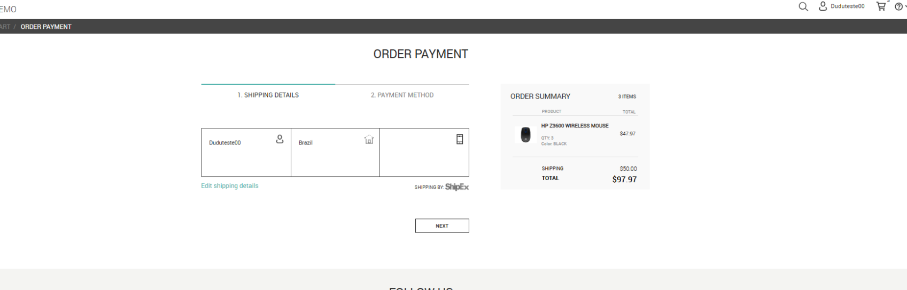
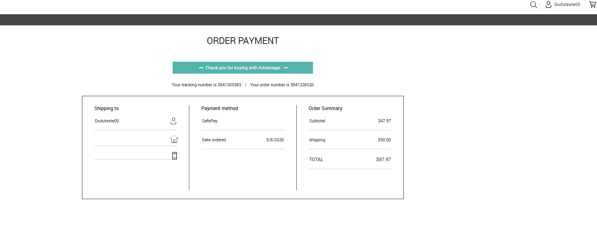

# BUG-005 – Sistema permite finalizar compra sem endereço de entrega

---

# Resumo

Foi identificado que o sistema permite concluir uma compra mesmo sem possuir informações obrigatórias de entrega cadastradas.

Durante o fluxo de checkout, o usuário consegue prosseguir normalmente até a confirmação do pedido, mesmo sem informar endereço, cidade, estado ou telefone.

Ao final da compra, o pedido é registrado com sucesso e a tela de confirmação exibe apenas o nome do usuário, deixando os demais campos de entrega em branco.

---

# Ambiente

- **Aplicação:** Advantage Online Shopping
- **Plataforma:** Web
- **Navegador:** Google Chrome
- **Usuário:** Autenticado

---

# Pré-condições

- Usuário autenticado.
- Conta criada apenas com os dados obrigatórios (Username, E-mail e Senha).
- Nenhum endereço de entrega cadastrado.
- Produto adicionado ao carrinho.

---

# Passos para reprodução

1. Realizar login na aplicação.
2. Adicionar um produto ao carrinho.
3. Acessar o checkout.
4. Prosseguir normalmente para a etapa de pagamento sem cadastrar endereço de entrega.
5. Selecionar um método de pagamento válido.
6. Clicar em **PAY NOW**.

---

# Resultado esperado

O sistema deve impedir a conclusão da compra enquanto as informações obrigatórias de entrega não forem preenchidas.

O usuário deve ser informado sobre quais campos precisam ser preenchidos antes da finalização do pedido.

---

# Resultado obtido

O sistema conclui a compra normalmente mesmo sem possuir endereço de entrega cadastrado.

Na tela de confirmação do pedido:

- apenas o nome do usuário é exibido;
- os campos de endereço permanecem vazios;
- o pedido é registrado normalmente.

---

# Impacto

O sistema permite a criação de pedidos sem informações essenciais para entrega dos produtos.

Esse comportamento compromete uma regra fundamental do processo de compra de um e-commerce, podendo gerar pedidos inconsistentes, impossibilidade de entrega e necessidade de intervenção manual para correção dos dados.

---

# Severidade

**Alta**

### Justificativa

A funcionalidade principal da aplicação permite concluir pedidos sem informações obrigatórias de entrega, comprometendo diretamente a integridade do processo de compra.

---

# Prioridade

**Alta**

### Justificativa

O defeito impacta uma etapa crítica do fluxo de checkout e deve ser corrigido para impedir a criação de pedidos inconsistentes.

---

# Evidências

## Figura 1 – Checkout sem endereço cadastrado

### Descrição

Usuário autenticado acessa o checkout sem possuir informações de entrega cadastradas e consegue prosseguir normalmente para a etapa de pagamento.

---

## Figura 2 – Pedido finalizado sem endereço de entrega

### Descrição

Após concluir a compra, o sistema registra o pedido normalmente, exibindo apenas o nome do usuário enquanto os demais campos de entrega permanecem vazios.

---

# Observações

- O comportamento foi reproduzido em múltiplas tentativas utilizando produtos diferentes.
- O problema ocorreu em todas as execuções do teste.
- Não foram identificadas validações obrigatórias para as informações de entrega durante o checkout.
- O sistema registra normalmente pedidos realizados sem endereço cadastrado.
- A tela de confirmação do pedido apresenta apenas o nome do usuário, mantendo endereço, cidade, estado e telefone em branco.
