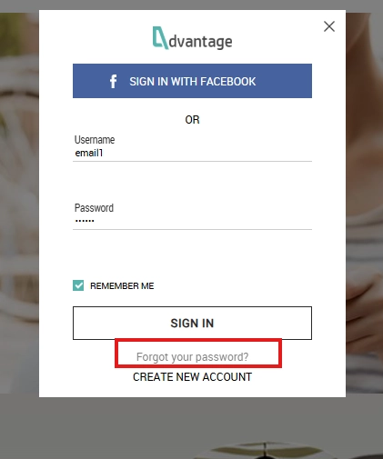

# BUG-006 – Link "Forgot your password?" não executa nenhuma ação

---

# Resumo

Foi identificado que o link **"Forgot your password?"** presente na tela de autenticação aparenta estar disponível para interação, porém não executa nenhuma ação quando acionado.

Apesar de o cursor indicar que o elemento é clicável, o sistema não abre o fluxo de recuperação de senha, não realiza redirecionamento e não apresenta qualquer mensagem ao usuário.

---

# Ambiente

- **Aplicação:** Advantage Online Shopping
- **Plataforma:** Web
- **Navegador:** Google Chrome
- **Usuário afetado:** Não autenticado

---

# Pré-condições

- Usuário deslogado.
- Tela de login aberta.

---

# Passos para reprodução

1. Acessar a aplicação.
2. Abrir a tela de login.
3. Posicionar o cursor sobre o link **"Forgot your password?"**.
4. Confirmar que o cursor indica um elemento clicável.
5. Clicar no link.

---

# Resultado esperado

Ao clicar em **"Forgot your password?"**, o sistema deve iniciar o fluxo de recuperação de senha, abrindo uma nova tela, modal ou realizando o redirecionamento correspondente.

---

# Resultado obtido

Nenhuma ação é executada após o clique.

O usuário permanece na mesma tela e o sistema não fornece qualquer feedback indicando erro ou indisponibilidade da funcionalidade.

---

# Impacto

Usuários que esqueceram sua senha não conseguem iniciar o processo de recuperação de acesso à conta.

A ausência dessa funcionalidade compromete um fluxo importante de autenticação e pode impedir o acesso de usuários legítimos.

---

# Severidade

**Média**

### Justificativa

O defeito afeta uma funcionalidade importante de autenticação ao impedir que usuários iniciem o processo de recuperação de senha. Entretanto, não compromete o funcionamento do login nem impede o acesso de usuários que conhecem suas credenciais.

---

# Prioridade

**Alta**

### Justificativa

Embora o problema não afete diretamente o fluxo principal de autenticação, impede usuários que esqueceram sua senha de recuperar o acesso à conta, impactando a experiência do usuário e podendo aumentar a demanda por suporte técnico.

---

# Evidências

## Figura 1 – Link de recuperação de senha indisponível

### Descrição

Tela de login exibindo o link **"Forgot your password?"**.

Apesar de o cursor indicar que o elemento é clicável, o sistema não executa qualquer ação após o clique.

- Não ocorre redirecionamento;
- Não é aberto nenhum modal;
- Nenhuma mensagem é exibida ao usuário;
- A tela de login permanece inalterada.

---

# Observações

- O comportamento foi reproduzido em todas as tentativas realizadas durante os testes.
- Não foram identificadas mensagens de erro visíveis ao usuário.
- O cursor do mouse é exibido no formato de **mão**, indicando que o elemento aparenta ser interativo.
- O clique não realiza redirecionamento, abertura de modal ou qualquer outra ação relacionada à recuperação de senha.
- O usuário permanece na mesma tela após a interação.
