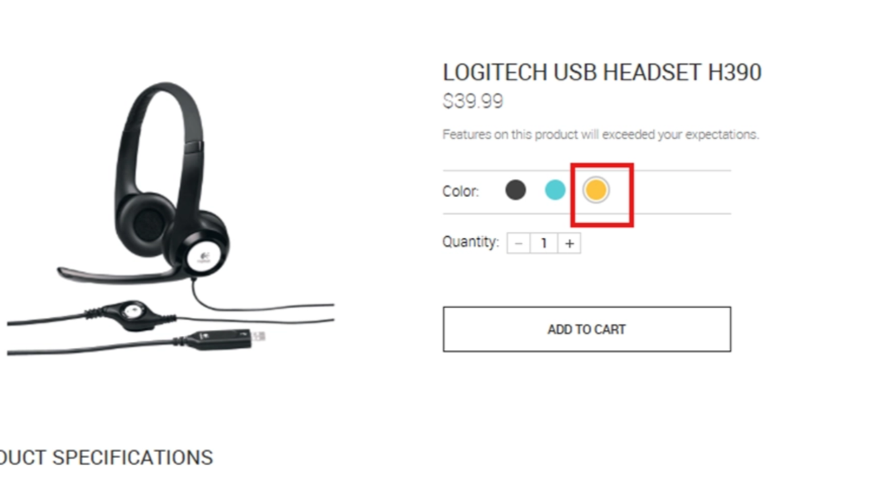
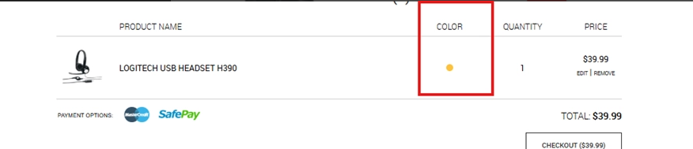

# BUG-007 – A imagem do produto não é atualizada ao selecionar determinadas variações de cor

---

# Resumo

Foi identificado que, em determinados produtos, a seleção de uma variação de cor não atualiza a imagem principal exibida na página do produto.

Apesar disso, a cor selecionada é registrada corretamente no carrinho de compras, indicando que a regra de negócio responsável pela seleção da variação funciona corretamente, porém sua representação visual permanece inconsistente.

O comportamento foi observado em diferentes produtos da aplicação.

---

# Ambiente

- **Aplicação:** Advantage Online Shopping
- **Plataforma:** Web
- **Navegador:** Google Chrome
- **Usuário afetado:** Autenticado e não autenticado

---

# Pré-condições

- Acessar um produto que possua múltiplas variações de cor.

---

# Passos para reprodução

1. Acessar a página de um produto com mais de uma opção de cor.
2. Selecionar uma cor diferente da exibida inicialmente.
3. Observar a imagem principal do produto.
4. Adicionar o produto ao carrinho.
5. Acessar o carrinho de compras.
6. Verificar a cor registrada para o produto.

---

# Resultado esperado

Ao selecionar uma nova cor, a imagem principal do produto deve ser atualizada para representar visualmente a variação escolhida.

A imagem exibida deve permanecer consistente com a cor selecionada e com as informações registradas no carrinho.

---

# Resultado obtido

Após selecionar uma nova cor, a imagem principal permanece exibindo a variação anterior, mesmo que outra opção tenha sido escolhida.

Entretanto, ao adicionar o produto ao carrinho, a cor selecionada é registrada corretamente, demonstrando que apenas a atualização visual da interface não acompanha a seleção realizada pelo usuário.

---

# Impacto

A inconsistência entre a imagem apresentada e a cor selecionada pode gerar dúvidas sobre qual versão do produto será adquirida.

Embora a regra de negócio funcione corretamente, a ausência de atualização visual compromete a experiência do usuário e reduz a confiabilidade das informações apresentadas durante a escolha da variação do produto.

---

# Severidade

**Média**

### Justificativa

A funcionalidade principal permanece operacional, porém a interface apresenta informações inconsistentes durante a seleção da variação do produto, podendo induzir o usuário ao erro.

---

# Prioridade

**Média**

### Justificativa

O defeito não impede a compra, porém afeta diretamente a experiência do usuário durante a seleção das variações do produto e deve ser corrigido para garantir consistência visual.

---

# Evidências

## Figura 1 – Seleção de cor sem atualização da imagem

### Descrição

Usuário seleciona uma variação de cor diferente da exibida inicialmente.

A cor é alterada corretamente na interface, porém a imagem principal do produto permanece exibindo a variação anterior.

---

## Figura 2 – Cor registrada corretamente no carrinho

### Descrição

Após adicionar o produto ao carrinho, a cor escolhida é registrada corretamente.

Isso demonstra que a regra de negócio da seleção de cor funciona normalmente e que a inconsistência está restrita à atualização visual da página do produto.

---

# Observações

- O comportamento foi reproduzido em diferentes produtos que possuem variações de cor.
- O problema ocorre tanto para usuários autenticados quanto para usuários não autenticados.
- A cor selecionada é registrada corretamente no carrinho de compras.
- A inconsistência está restrita à atualização da imagem principal do produto.
- O defeito pode levar o usuário a acreditar que a alteração de cor não foi aplicada corretamente.
