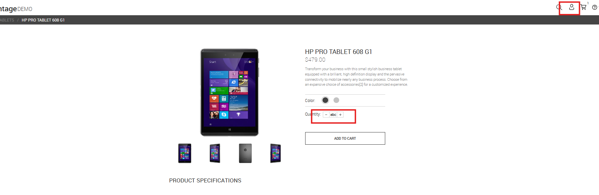
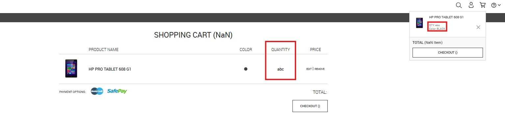

# BUG-008 – Edição do carrinho permite inserir valores não numéricos na quantidade para usuários não autenticados

---

# Resumo

Foi identificado que, durante a edição de um item do carrinho, usuários não autenticados conseguem informar caracteres não numéricos no campo **Quantity**.

Após salvar a alteração, o sistema aceita o valor inválido e atualiza o carrinho com uma quantidade não numérica, comprometendo os cálculos da aplicação e exibindo valores inválidos como **NaN**.

O comportamento não ocorre para usuários autenticados, indicando uma inconsistência na validação entre os dois fluxos.

---

# Ambiente

- **Aplicação:** Advantage Online Shopping
- **Plataforma:** Web
- **Navegador:** Google Chrome
- **Usuário afetado:** Não autenticado

---

# Pré-condições

- Usuário não autenticado.
- Produto adicionado ao carrinho.

---

# Passos para reprodução

1. Adicionar um produto ao carrinho.
2. Acessar o carrinho de compras.
3. Selecionar a opção **EDIT** do produto.
4. No campo **Quantity**, substituir o valor por um texto não numérico (ex.: **abc**).
5. Clicar em **ADD TO CART**.
6. Retornar ao carrinho.

---

# Resultado esperado

O sistema deve permitir apenas valores numéricos inteiros positivos no campo de quantidade.

Caso um valor inválido seja informado, a alteração deve ser bloqueada e o usuário deve receber uma mensagem de validação.

---

# Resultado obtido

O sistema aceita caracteres não numéricos no campo de quantidade e salva a alteração sem qualquer validação.

Como consequência:

- a quantidade passa a ser exibida como **abc**;
- o contador do carrinho apresenta **NaN**;
- o resumo do carrinho torna-se inconsistente;
- o botão de checkout apresenta informações incorretas;
- o valor total deixa de ser calculado corretamente.

---

# Impacto

A ausência de validação permite que dados inválidos sejam persistidos no carrinho de compras.

Além de comprometer a integridade das informações, o problema afeta os cálculos da aplicação e pode comprometer o fluxo de checkout, tornando o carrinho inconsistente.

---

# Severidade

**Alta**

### Justificativa

O sistema permite persistir dados inválidos em um campo crítico do processo de compra, comprometendo os cálculos do carrinho e a consistência das informações apresentadas ao usuário.

---

# Prioridade

**Alta**

### Justificativa

O defeito afeta diretamente uma funcionalidade crítica da aplicação (carrinho de compras) e deve ser corrigido para impedir que dados inválidos sejam aceitos durante o fluxo de compra.

---

# Evidências

## Figura 1 – Inserção de valor não numérico na quantidade

### Descrição

Usuário não autenticado edita um produto já existente no carrinho e informa o valor **abc** no campo **Quantity**.

O sistema aceita o valor informado sem realizar qualquer validação.

---

## Figura 2 – Carrinho inconsistente após salvar a alteração

### Descrição

Após confirmar a edição, o carrinho passa a apresentar informações inválidas.

A quantidade é exibida como **abc**, enquanto o contador de itens apresenta **NaN**, comprometendo os cálculos da aplicação e o resumo da compra.

---

# Observações

- O comportamento foi reproduzido em múltiplas tentativas durante os testes.
- O problema ocorre apenas para usuários não autenticados.
- O mesmo fluxo foi executado utilizando um usuário autenticado, onde o sistema não permitiu salvar o valor inválido.
- O defeito evidencia uma inconsistência na validação entre usuários autenticados e não autenticados.
- A falha permite que dados inválidos sejam persistidos no carrinho, comprometendo a integridade das informações e dos cálculos da aplicação.
