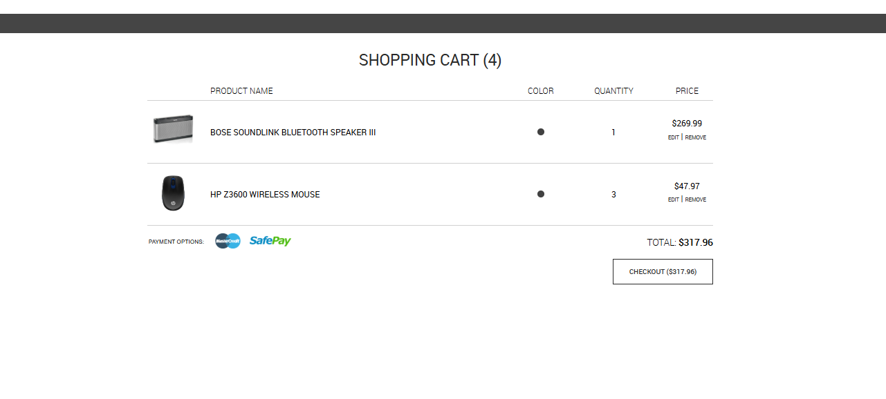
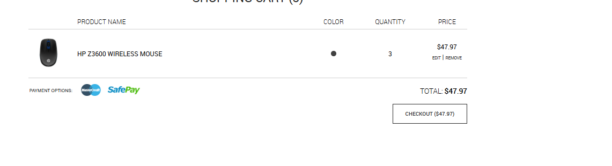

# BUG-009 – Inconsistência na persistência do último item do carrinho para usuários não autenticados

---

# Resumo

Foi identificado que, para usuários não autenticados, o último produto adicionado ao carrinho é removido após um fluxo específico de navegação.

O comportamento ocorre quando o carrinho já possui mais de um item. Após adicionar um novo produto, acessar o carrinho, retornar à página inicial e atualizar a aplicação, o último item adicionado desaparece, enquanto os demais permanecem no carrinho.

O problema não ocorre quando existe apenas um único produto no carrinho.

---

# Ambiente

- **Aplicação:** Advantage Online Shopping
- **Plataforma:** Web
- **Navegador:** Google Chrome
- **Usuário afetado:** Não autenticado

---

# Pré-condições

- Usuário não autenticado.
- Carrinho contendo pelo menos um produto.
- Possuir um segundo produto disponível para adicionar ao carrinho.

---

# Passos para reprodução

1. Acessar a aplicação sem realizar login.
2. Adicionar um produto ao carrinho.
3. Adicionar um segundo produto ao carrinho.
4. Acessar o carrinho e confirmar que ambos os produtos estão presentes.
5. Retornar à página inicial.
6. Atualizar a página utilizando **F5**.
7. Acessar novamente o carrinho.

---

# Resultado esperado

Todos os produtos adicionados ao carrinho devem permanecer armazenados durante a navegação e após a atualização da página, mantendo a consistência do estado da sessão do usuário.

---

# Resultado obtido

Após atualizar a página, o último produto adicionado ao carrinho é removido automaticamente.

Os demais produtos permanecem armazenados normalmente.

O comportamento foi observado apenas quando o carrinho possuía mais de um item.

---

# Impacto

O sistema perde parte das informações armazenadas no carrinho sem qualquer ação do usuário.

Esse comportamento pode levar à perda de produtos selecionados, comprometendo a experiência de compra e aumentando a possibilidade de abandono do carrinho.

Além disso, a inconsistência reduz a confiabilidade da aplicação durante um dos principais fluxos de um e-commerce.

---

# Severidade

**Alta**

### Justificativa

O defeito provoca perda de dados durante o fluxo de compra, comprometendo diretamente a persistência das informações do carrinho.

---

# Prioridade

**Alta**

### Justificativa

O problema afeta uma funcionalidade crítica da aplicação e pode resultar na perda de produtos antes da conclusão da compra.

---

# Evidências

## 🎥 Vídeo de reprodução

### Descrição

O vídeo demonstra todo o fluxo de reprodução do defeito, desde a inclusão de múltiplos produtos no carrinho até o desaparecimento do último item após a atualização da página.

**Arquivo:** `reproduction.gif`

---

## Figura 1 – Carrinho contendo múltiplos produtos

### Descrição

Usuário não autenticado adiciona dois produtos ao carrinho antes da reprodução do defeito.

Ambos os produtos permanecem visíveis e o carrinho apresenta as informações esperadas.

---

## Figura 2 – Último produto removido após atualização

### Descrição

Após retornar à página inicial e atualizar a aplicação (**F5**), o usuário acessa novamente o carrinho.

O último produto adicionado desaparece, enquanto os demais permanecem armazenados normalmente.

---

# Observações

- O comportamento foi reproduzido diversas vezes durante os testes.
- O defeito ocorre apenas para usuários não autenticados.
- O problema é observado somente quando existem dois ou mais produtos no carrinho.
- Quando existe apenas um único produto no carrinho, o comportamento não é reproduzido.
- Em todas as reproduções, apenas o último produto adicionado foi removido após a atualização da página.
- O defeito foi documentado também por meio de um GIF demonstrando todo o fluxo de reprodução.
