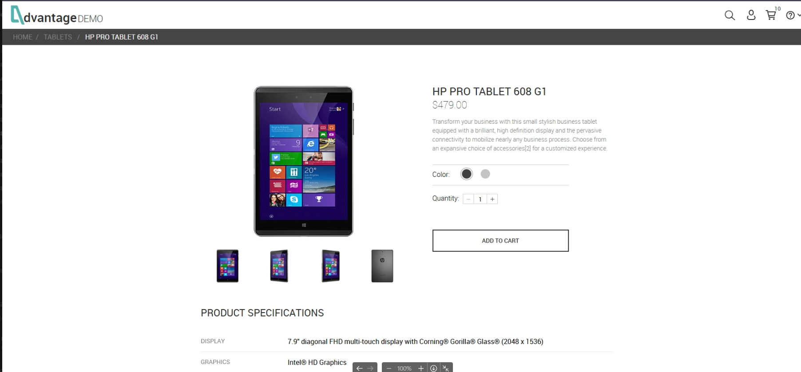

# Evidências do BUG-001

## Figura 1 – Primeira tentativa

### Descrição

Usuário não autenticado tenta adicionar **11 unidades** de um produto cujo estoque disponível é de apenas **10 unidades**.

### Resultado observado

- O sistema exibe corretamente a mensagem informando que apenas a quantidade disponível foi adicionada ao carrinho.
- O carrinho é atualizado com **10 unidades**.

---

## Figura 2 – Tentativa após retornar à Home

### Descrição

Após retornar à página inicial e acessar novamente o mesmo produto, o usuário tenta adicionar novamente **11 unidades**.

### Resultado observado

- O sistema continua limitando corretamente o carrinho para **10 unidades**.
- A mensagem de validação deixa de ser exibida para usuários não autenticados.

---

## Conclusão

O comportamento evidencia uma inconsistência na exibição da mensagem de validação entre a primeira e as tentativas subsequentes para usuários não autenticados, embora a regra de negócio continue sendo aplicada corretamente.
